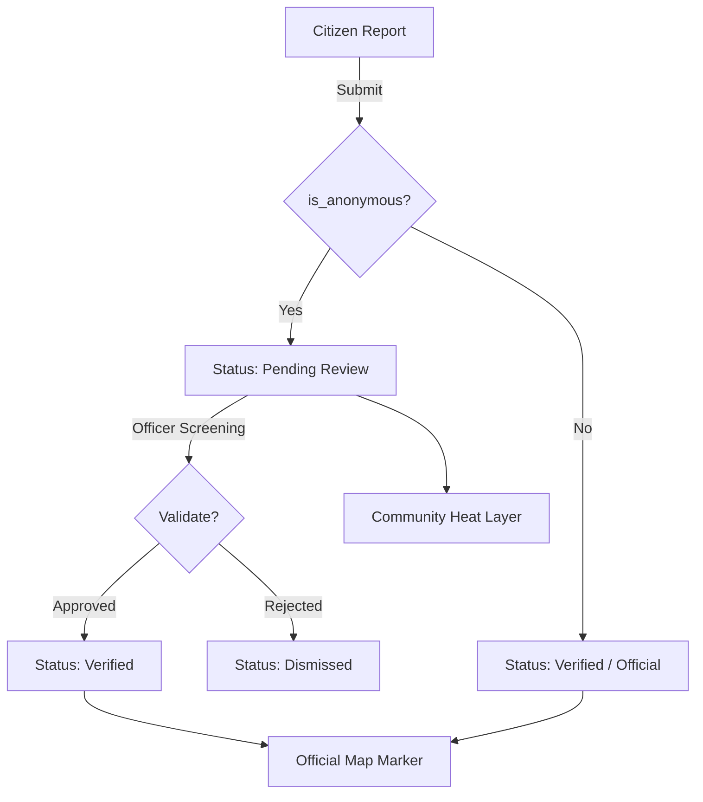

# 🗺️ SAFEMAP GenSan
### *Empowering General Santos City through Community-Driven Safety Intelligence*

[](https://github.com/your-repo)
[](https://github.com/your-repo)
[](https://github.com/your-repo)

---

## 📋 Executive Summary
**SAFEMAP GenSan** is a state-of-the-art geo-spatial safety monitoring platform specifically engineered for the unique urban landscape of **General Santos City**. By bridging the gap between community-reported incidents and official police records, the system provides a comprehensive, real-time safety "operating picture." It serves as both a public awareness tool for citizens and a decision-support system for law enforcement (PNP) and local government units (LGU).

---

## 🔍 Research Problem Statement
Despite modern policing efforts, urban safety in rapidly growing cities like General Santos faces three critical challenges:
1.  **Reporting Friction:** Many community-level safety issues go unreported due to complex official procedures or fear of exposure.
2.  **Data Silos:** Community awareness is often disconnected from official police datasets, leading to incomplete risk assessments.
3.  **Connectivity Latency:** Traditional digital reporting fails in high-density or low-signal areas where incidents are most likely to occur.

**SAFEMAP GenSan** addresses these by providing a low-friction, offline-first reporting mechanism that integrates community data with an official administrative verification layer.

---

## 🎯 System Objectives
- **Centralize Safety Data:** Create a unified dashboard for all safety-related incidents in GenSan.
- **Enhance Public Awareness:** Provide citizens with a real-time heatmap of unverified community reports for proactive safety.
- **Ensure Data Integrity:** Implement a Human-in-the-Loop (HITL) verification process where PNP officers validate community reports before they enter official records.
- **Guarantee Accessibility:** Ensure 100% uptime for incident encoding through advanced Progressive Web App (PWA) and offline queueing technologies.

---

## 🚀 Core Features

### 1. Interactive Map Dashboard
- **Leaflet Integration:** High-performance raster and vector mapping.
- **Verified vs. Community Layers:** A toggleable system allowing users to see official police markers alongside broad community "heat" indicators.
- **Geocoding Search:** Integration with the Photon API for precise landmark and address lookup within GenSan city limits.

### 2. Multi-Stage Reporting Workflow
- **Human-Centric Form:** A 3-step reporting process designed to reduce cognitive load during high-stress situations.
- **Anonymity Support:** Users can opt for anonymous submissions to protect privacy while contributing to city safety.
- **Multimedia Attachment:** Support for photo uploads to provide visual evidence for reports.

### 3. Administrative Governance (Admin Queue)
- **Review Pipeline:** All community reports enter a `Pending Review` state.
- **Official Validation:** PNP officers can view report details, landmark proximity, and descriptions before marking as `Verified` or `Dismissed`.
- **Status Ecosystem:** Reports transition through `Unverified`, `Pending Review`, `Verified`, and `Dismissed`.

### 4. Emergency Infrastructure
- **Rapid-Access Drawer:** A persistent emergency button providing instant one-tap access to GenSan's critical contacts (PNP, WCPD, BFP, DSWD, Red Cross).
- **Proactive Disclaimers:** Clear UI indicators distinguishing between unverified community reports and officially confirmed data.

---

## 🛠️ Technical Architecture

### Tech Stack
| Component | Technology | Purpose |
| :--- | :--- | :--- |
| **Frontend** | React 18 + TypeScript | UI Logic & Type Safety |
| **Bundler** | Vite | Ultra-fast build & development |
| **Styling** | Tailwind CSS + shadcn/ui | Modern, responsive, premium aesthetics |
| **Maps** | React-Leaflet | Geo-spatial visualization |
| **State/Sync** | TanStack Query v5 | Server state management & caching |
| **Validation** | Zod | Rigorous data schema enforcement |
| **Persistence** | Supabase | Real-time database & Authentication |
| **Reliability** | vite-plugin-pwa | Offline access & Background sync |

### Data Lifecycle Diagram


---

## 🛡️ Data Governance & Ethics
- **Human-in-the-Loop:** No report is elevated to "Official" status without human screening, preventing "Data Poisoning" or spam.
- **Privacy First:** Anonymous reports never display submitter details to the public.
- **Public Safety Warning:** The system explicitly states that reports do not replace 911/emergency calls.

---

## 💻 Installation & Development

### Prerequisites
- Node.js (v18.x or higher)
- npm or pnpm

### Setup
1. **Clone the repository:**
   ```bash
   git clone [repository-url]
   cd safemap-gensan
   ```
2. **Install dependencies:**
   ```bash
   npm install
   ```
3. **Environment Configuration:**
   Create a `.env` file in the root directory:
   ```env
   VITE_SUPABASE_URL=your_url
   VITE_SUPABASE_ANON_KEY=your_key
   ```
4. **Run Development Server:**
   ```bash
   npm run dev
   ```
5. **Build for Production:**
   ```bash
   npm run build
   ```

---

## 🏢 Business Value Proposition
For the **Local Government of GenSan**, SAFEMAP offers:
1.  **Cost Efficiency:** Replaces expensive, legacy incident logging with a modern, scalable web-cloud solution.
2.  **Strategic Resource Allocation:** Heatmaps provide data-driven insights on where to deploy street lighting, CCTV, or police patrols.
3.  **Increased Public Trust:** Demonstrates a commitment to transparency and community involvement in urban safety.

---

## 👥 Research Team
- **[Lead Developer/Researcher Name]**
- **Group Members Name/Team Group**
- **Institution/Affiliation**

---

*Safemap GenSan is an ongoing research project aimed at digitalizing public safety infrastructure for the residents of General Santos City.*
